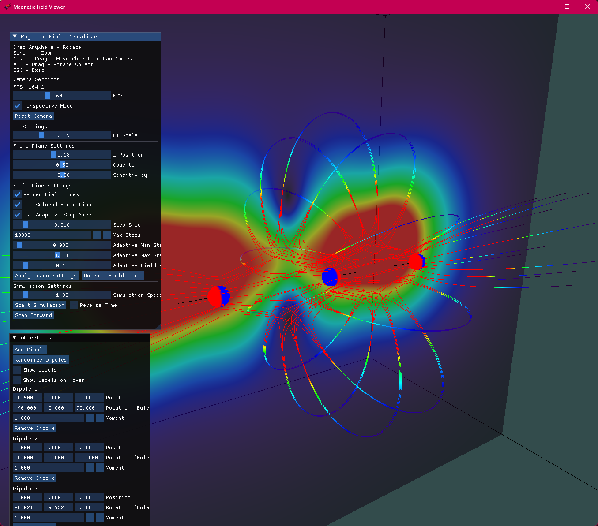
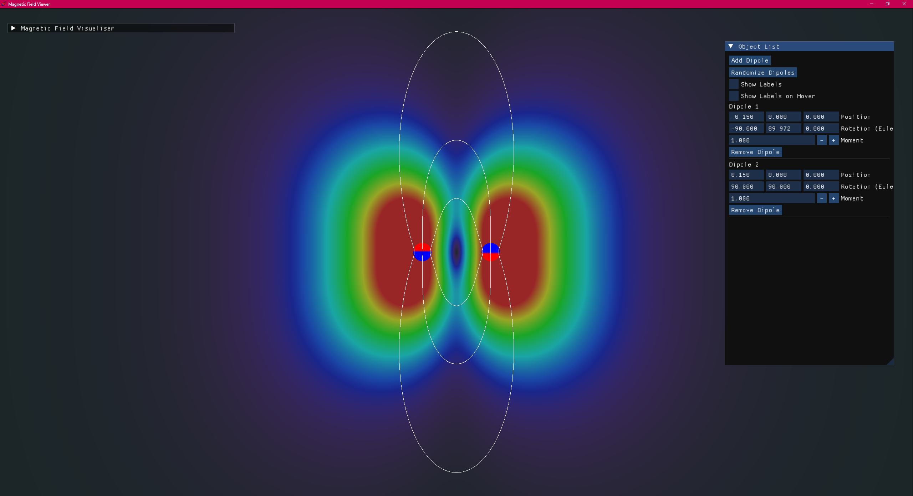
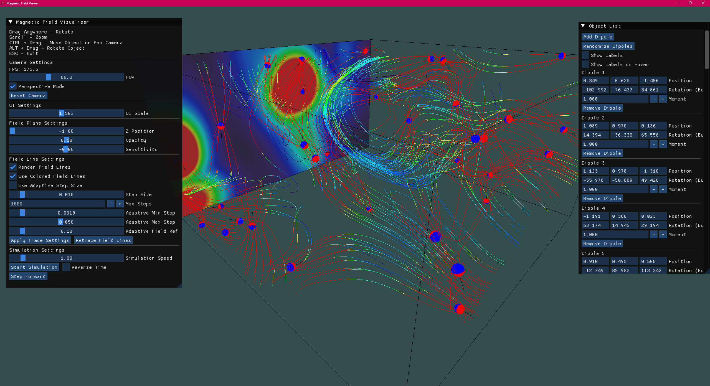

# Visualising Magnetic Fields: A 3d Dynamic Field Simulation

50.017 Graphics and Visualisation

Contributors: Seah Ying Xiang, Paul Ong, Loy Pek Yong


This OpenGL-based application visualizes magnetic fields in real-time from user-manipulated dipoles in a 3D environment. Built with GLFW, GLM, ImGui, and custom shaders, it offers real-time interaction, field line tracing, and other nifty features.

You can download and run it yourself here: [[Latest Release, Windows Only](https://github.com/seahyx/magnetic-field-gl/releases/latest/)]

## Setup and Build Instructions (Windows with Visual Studio)

### Prerequisites

- **Visual Studio**: Install Visual Studio 2019 or later (Community, Professional, or Enterprise) with the **Desktop development with C++** workload from [visualstudio.microsoft.com](https://visualstudio.microsoft.com/).
- **GLFW**: Download 32-bit Windows binaries from [glfw.org/download.html](https://glfw.org/download.html). Copy `glfw3.lib` (e.g., from `lib-vc2019`) to the project’s `libs` folder.
- **Dependencies**: Ensure GLM, ImGui, and GLAD are in the `includes` folder. Shader files (`shader.frag`, `field_line.vert`, `field_line.frag`) should be in the project directory or a `shaders` subdirectory.
- **Directory Structure**:

```txt
MagneticFieldVisualizer/
├── includes/         # GLM, ImGui, GLAD
├── libs/             # glfw3.lib
├── src/              # main.cpp, camera.cpp, etc.
├── MagneticFieldVisualizer.sln
├── README.md
```

### Visual Studio Setup

1. Open `MagneticFieldVisualizer.sln` in Visual Studio.
2. In **Project Properties**:
   - **C/C++ > General**: Add `$(SolutionDir)includes` to **Additional Include Directories**.
   - **Linker > General**: Add `$(SolutionDir)libs` to **Additional Library Directories**.
   - **Linker > Input**: Add `glfw3.lib;opengl32.lib` to **Additional Dependencies**.
   - Apply for **Debug** and **Release** configurations.
3. Verify source files (`main.cpp`, `camera.cpp`, etc.) are in **Source Files** and shaders are accessible.

### Build and Run

1. Set configuration to **Debug** or **Release** and platform to **Win64** (x64).
2. Click **Build > Build Solution** (`Ctrl+Shift+B`).
3. Run via **Debug > Start Without Debugging** (`Ctrl+F5`).
4. If errors occur:
   - Ensure `glfw3.lib` is in `libs`.
   - Check shader file paths in `main.cpp`.
   - Copy `glfw3.dll` to the executable directory if needed.

## Key Features

- **Dipole Interaction**: Add, move (Ctrl+drag), or rotate (Alt+drag) dipoles, visualized as spheres with directional arrows.
- **Field Visualization**: Real-time field plane with color gradients (blue to red) for field strength, adjustable via ImGui.
- **Field Line Tracing**: Traces field lines using a 4th-order Runge-Kutta method with adaptive steps, parallelized for performance.
- **Camera Controls**: Perspective/orthographic modes, zoom (scroll), rotate (drag), and reset. No more snapping, we promise!
- **ImGui Interface**: Controls camera, dipoles, field lines, and visualization settings, plus FPS display.

## UI Reference

### Instructions Panel

This section displays key interaction controls to the user:

- Drag Anywhere – Rotate the scene
- Scroll – Zoom in/out
- CTRL + Drag – Move objects or pan the camera
- ALT + Drag – Rotate selected objects
- ESC – Exit the application

### Camera Settings

Users can control the camera behavior and reset it when needed:

- Frames Per Second (FPS) is shown for performance feedback.
- Field of View (FOV) can be adjusted via a slider.
- Perspective Mode Toggle allows switching between perspective and orthographic views.
- Reset Camera Button returns the camera to its default position, rotation, and view target.

### Field Plane Settings

This section configures the visualization of the plane used for field line rendering:

- Z Position Slider adjusts the depth placement of the field plane.
- Opacity Slider controls plane transparency.
- Sensitivity Slider modifies how strongly field strength variations appear visually.

### Field Line Settings

Users can customize how magnetic field lines are rendered:

- Render Field Lines – Toggle field line visibility.
- Use Colored Field Lines – Enable color-coding based on field strength.
- Adaptive Step Size Toggle – Enables variable step lengths when tracing field lines.

Trace Settings:

- Step Size – Base step increment for tracing lines.
- Max Steps – Limits how long lines can grow.
- Adaptive Step Range – Minimum and maximum values for adaptive steps.
- Reference Field Strength – Used to normalize adaptive stepping.
- Apply Trace Settings – Applies the current settings to the tracer.
- Retrace Field Lines – Recomputes all field lines based on updated parameters.

### Simulation Settings

This panel manages the dynamic simulation of magnetic dipoles:

- Simulation Speed Slider – Controls the time step scale.
- Start/Stop Simulation Button – Begins or pauses the simulation.
- Reverse Time Toggle – Reverses the direction of simulation time.
- Step Forward Button – Manually progresses the simulation by one frame.

### Object Management Panel

Users can add, remove, and edit magnetic dipoles:

- Add Dipole Button – Adds a new magnetic dipole at the origin with default orientation.
- Randomize Dipoles Button – Randomly repositions and reorients all dipoles within a bounding volume.

Label Toggles:

- Show Labels – Display all dipole names.
- Show Labels on Hover – Only show labels when hovered.

### Per-Dipole Controls

For each dipole in the scene:

- Dipole Header – Identifies the dipole by index (e.g., Dipole 1, Dipole 2...).
- Position Editor – Adjusts the dipole's 3D world position.
- Rotation Editor – Allows orientation input via Euler angles (in degrees).
- Moment Editor – Changes the magnetic moment magnitude.
- Remove Button – Deletes the dipole, reordering and updating all relevant lists and buffers.

## Credits

- **Field Line Tracing Algorithm**: Adapted from Chen, Jun’s 4th-order Runge-Kutta method in “Numerical solution of tracing magnetic field line” (2020), [el2718@mail.ustc.edu.cn](mailto:el2718@mail.ustc.edu.cn).
- **Dependencies**: GLFW, GLM, ImGui, GLAD. Thanks for carrying our code’s weight.
- **Team**: We stumbled through quaternions and shaders so you can enjoy pretty magnetic fields.

## Screenshots





## License

Provided for educational use. Respect the licenses of GLFW, GLM, ImGui, and GLAD.
